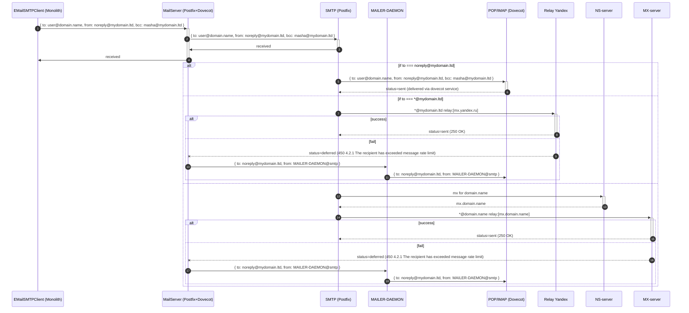

# Postfix+Dovecot+RoundCube MailServer
### How to use
* Install [docker-compose](https://docs.docker.com/compose/install/)
* Copy .env.example and custom it
```js
cp .env.example .env
```
* Put your certs files to ./assets/certs
* Put your dkim files to ./assets/dkim
* Run docker-composer for mailserver
```js
docker-compose build mailserver
docker-compose up -d mailserver
```

### Scheme of working


